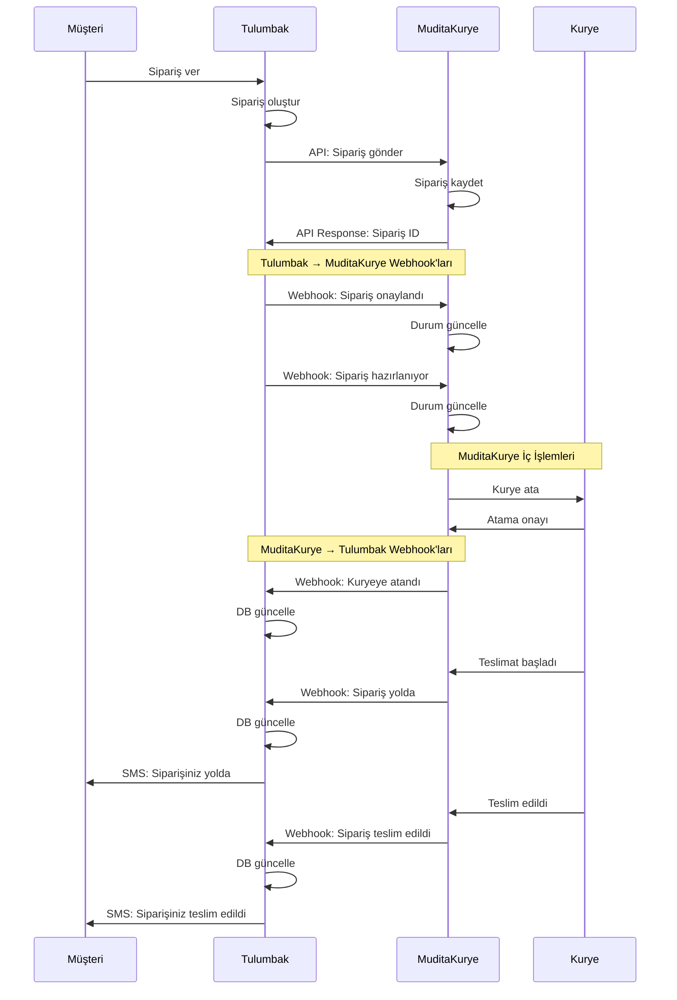

# 🔄 Kurye Entegrasyon Sistemi - Detaylı Akış Açıklaması

## 📊 Sistem Akış Diyagramı



## 🎯 İki Yönlü Webhook Sistemi

### 1️⃣ Tulumbak → MuditaKurye Webhook'ları
**Ne zaman gönderilir?**
- Sipariş durumu değiştiğinde
- Müşteri sipariş iptal ettiğinde
- Restoran siparişi hazır olarak işaretlediğinde
- Ödeme durumu değiştiğinde

**Webhook Payload Örneği:**
```json
{
  "webhookId": "wh_123456789",
  "timestamp": 1762946461893,
  "event": "order.status.updated",
  "signature": "hmac_sha256_signature",
  "data": {
    "orderId": "ORD_2024_001",
    "muditaOrderId": "MK_2024_001",
    "status": "PREPARED",
    "statusMessage": "Sipariş hazır, kurye bekleniyor",
    "restaurant": {
      "id": "REST_001",
      "name": "Tulumbak Restaurant",
      "address": "İstanbul, Türkiye"
    },
    "customer": {
      "name": "Ahmet Yılmaz",
      "phone": "+905551234567",
      "address": "Kadıköy, İstanbul"
    },
    "orderDetails": {
      "items": ["1x Lahmacun", "2x Ayran"],
      "totalAmount": 150.00,
      "paymentMethod": "ONLINE",
      "paymentStatus": "PAID"
    }
  }
}
```

**Webhook Endpoint (MuditaKurye tarafında):**
```
POST https://api.muditakurye.com.tr/webhook/order-update
Headers:
  X-Tulumbak-Signature: {HMAC-SHA256 signature}
  X-Tulumbak-Timestamp: {Unix timestamp}
  Content-Type: application/json
```

### 2️⃣ MuditaKurye → Tulumbak Webhook'ları
**Ne zaman gelir?**
- Kurye atandığında
- Kurye siparişi aldığında
- Teslimat başladığında
- Sipariş teslim edildiğinde
- Teslimat başarısız olduğunda

**Webhook Payload Örneği (Tulumbak'a gelen):**
```json
{
  "muditaOrderId": "MK_2024_001",
  "orderId": "ORD_2024_001",
  "status": "ASSIGNED",
  "timestamp": 1762946461893,
  "courier": {
    "id": "COURIER_001",
    "name": "Mehmet Kurye",
    "phone": "+905559876543",
    "vehicleType": "MOTORCYCLE",
    "plateNumber": "34 ABC 123"
  },
  "location": {
    "latitude": 41.0082,
    "longitude": 28.9784
  },
  "estimatedDeliveryTime": "2025-11-12T12:30:00Z",
  "notes": "Kurye yola çıktı"
}
```

**Webhook Endpoint (Tulumbak tarafında - zaten kurulu):**
```
POST https://api.tulumbak.com/api/webhook/muditakurye
Headers:
  X-MuditaKurye-Signature: {HMAC-SHA256 signature}
  X-Mudita-Timestamp: {Unix timestamp}
  Content-Type: application/json
```

## 📋 Sipariş Yaşam Döngüsü

### Tulumbak Tarafında Durumlar
1. **Siparişiniz Alındı** → MuditaKurye'ye bildir
2. **Hazırlanıyor** → MuditaKurye'ye bildir
3. **Kurye Bekleniyor** → MuditaKurye'ye bildir
4. **Kuryeye Verildi** → (MuditaKurye'den gelen webhook ile)
5. **Yolda** → (MuditaKurye'den gelen webhook ile)
6. **Teslim Edildi** → (MuditaKurye'den gelen webhook ile)

### MuditaKurye Tarafında Durumlar
1. **VALIDATED** - Sipariş doğrulandı
2. **ASSIGNED** - Kuryeye atandı
3. **PREPARED** - Hazırlandı (Tulumbak'tan webhook ile)
4. **PICKED_UP** - Kurye aldı
5. **ON_DELIVERY** - Teslimat yolunda
6. **DELIVERED** - Teslim edildi
7. **FAILED** - Teslimat başarısız
8. **CANCELED** - İptal edildi

## 🔐 Güvenlik Mekanizmaları

### HMAC-SHA256 İmza Doğrulama
```javascript
// Tulumbak → MuditaKurye webhook imzası
const generateTulumbakSignature = (payload, timestamp) => {
  const secret = process.env.TULUMBAK_WEBHOOK_SECRET;
  const message = `${timestamp}.${JSON.stringify(payload)}`;
  return crypto.createHmac('sha256', secret).update(message).digest('hex');
};

// MuditaKurye → Tulumbak webhook imzası (zaten kurulu)
const verifyMuditaSignature = (payload, signature, timestamp) => {
  const secret = process.env.MUDITA_WEBHOOK_SECRET;
  const message = `${timestamp}.${JSON.stringify(payload)}`;
  const expectedSignature = crypto.createHmac('sha256', secret).update(message).digest('hex');
  return crypto.timingSafeEqual(
    Buffer.from(signature),
    Buffer.from(expectedSignature)
  );
};
```

## 🧪 Test Senaryoları

### Test 1: Tam Döngü Testi
```
1. Tulumbak'ta test siparişi oluştur
2. MuditaKurye API'ye sipariş gönder
3. Tulumbak → MuditaKurye webhook gönder (PREPARED)
4. MuditaKurye'den kurye atama webhook'u al
5. MuditaKurye'den teslimat başlangıç webhook'u al
6. MuditaKurye'den teslimat tamamlama webhook'u al
7. Tüm durum güncellemelerini doğrula
```

### Test 2: İptal Senaryosu
```
1. Aktif sipariş oluştur
2. Müşteri tarafından iptal et
3. Tulumbak → MuditaKurye iptal webhook'u gönder
4. MuditaKurye'den iptal onayı webhook'u al
5. Veritabanında iptal durumunu doğrula
```

### Test 3: Hata Senaryoları
```
1. Yanlış imza ile webhook gönder → Red edilmeli
2. Timeout simülasyonu → Retry mekanizması çalışmalı
3. Duplicate webhook → Idempotency koruması çalışmalı
4. Geçersiz payload → Validation hatası dönmeli
```

## 🚀 Implementasyon Öncelikleri

### Faz 1: Temel Webhook Gönderimi (Öncelik: Kritik)
```javascript
// backend/services/TulumbakWebhookService.js
class TulumbakWebhookService {
  async sendToMuditaKurye(event, orderData) {
    const webhook = {
      webhookId: generateWebhookId(),
      timestamp: Date.now(),
      event,
      signature: generateSignature(orderData),
      data: orderData
    };

    return await sendWebhook(
      MUDITA_WEBHOOK_URL,
      webhook,
      retryConfig
    );
  }
}
```

### Faz 2: Webhook Yönetim Paneli
- Giden webhook'ları listeleme
- Gelen webhook'ları listeleme
- Başarısız webhook'ları yeniden gönderme
- Webhook loglarını görüntüleme

### Faz 3: Monitoring & Alerting
- Webhook başarı/başarısızlık oranları
- Ortalama response time
- Hata pattern tespiti
- Otomatik alert sistemi

## 📊 Admin Panel Webhook Yönetimi

### Webhook Dashboard Görünümü
```
┌─────────────────────────────────────────────────────┐
│  📡 Webhook Yönetimi                                │
├─────────────────────────────────────────────────────┤
│                                                      │
│  ┌─────────────────┬─────────────────┐             │
│  │  Giden Webhooks │  Gelen Webhooks │             │
│  └─────────────────┴─────────────────┘             │
│                                                      │
│  📤 Giden Webhooks (Tulumbak → MuditaKurye)        │
│  ┌──────────────────────────────────────────┐      │
│  │ ID      | Event         | Status | Retry │      │
│  │ wh_001  | order.created | ✅     | 0     │      │
│  │ wh_002  | order.updated | ⏳     | 1     │      │
│  │ wh_003  | order.cancel  | ❌     | 3     │      │
│  └──────────────────────────────────────────┘      │
│                                                      │
│  📥 Gelen Webhooks (MuditaKurye → Tulumbak)        │
│  ┌──────────────────────────────────────────┐      │
│  │ ID      | Event          | Status | Time  │      │
│  │ mk_001  | courier.assign | ✅     | 12ms  │      │
│  │ mk_002  | order.deliver  | ✅     | 8ms   │      │
│  │ mk_003  | order.failed   | ✅     | 15ms  │      │
│  └──────────────────────────────────────────┘      │
│                                                      │
│  [📊 İstatistikler] [🔄 Yenile] [⚙️ Ayarlar]       │
└─────────────────────────────────────────────────────┘
```

## 🔧 Konfigürasyon Yönetimi

### Environment Variables
```env
# Tulumbak → MuditaKurye Webhook Ayarları
TULUMBAK_WEBHOOK_SECRET=your_secret_key_for_outgoing_webhooks
MUDITA_WEBHOOK_ENDPOINT=https://api.muditakurye.com.tr/webhook/order-update
TULUMBAK_WEBHOOK_RETRY_COUNT=3
TULUMBAK_WEBHOOK_TIMEOUT=30000

# MuditaKurye → Tulumbak Webhook Ayarları (mevcut)
MUDITA_WEBHOOK_SECRET=wh_0rC-rimL096iJALsxXui67-n0LrKWVNlpHknLHn12g4
MUDITA_WEBHOOK_ONLY_MODE=false # API anahtarları gelince
```

## 📈 Başarı Metrikleri

### Teknik Metrikler
- Webhook başarı oranı > %99
- Ortalama işlem süresi < 500ms
- Retry başarı oranı > %95
- Uptime > %99.9

### İş Metrikleri
- Sipariş-teslimat süresi azalması
- Kurye atama hızı artışı
- Müşteri memnuniyeti artışı
- Operasyonel verimlilik artışı

## 🎯 Sonuç

Bu dokümantasyon, Tulumbak ve MuditaKurye arasındaki **çift yönlü webhook entegrasyonunu** detaylı olarak açıklamaktadır:

1. **Tulumbak → MuditaKurye**: Sipariş durumu güncellemeleri
2. **MuditaKurye → Tulumbak**: Kurye ve teslimat güncellemeleri

Sistem, güvenli HMAC imzalama, retry mekanizması ve idempotency koruması ile production-ready bir yapıda tasarlanmıştır.

---
*Dokümantasyon Tarihi: 2025-11-12*
*Versiyon: 1.1.0*