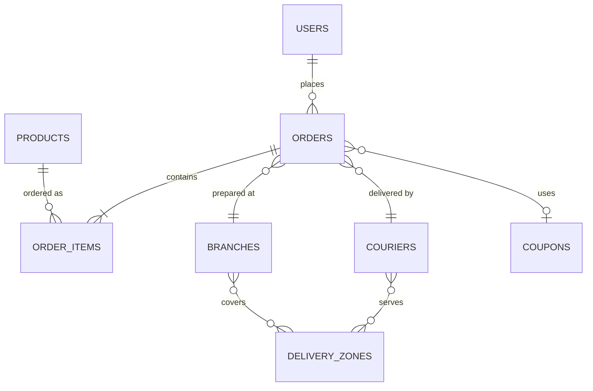

# Database Schema Documentation

**Last Updated**: 2025-11-13

MongoDB database schema and collections for Tulumbak E-Commerce Platform.

## Database Overview

- **Database Name**: `ecommerce`
- **Type**: MongoDB (Document-based NoSQL)
- **ODM**: Mongoose
- **Indexes**: Optimized for common query patterns

---

## Collections

### users

Customer accounts and authentication.

**Schema:**
```javascript
{
  _id: ObjectId,
  name: String (required),
  email: String (required, unique, lowercase),
  password: String (required, hashed with bcrypt),
  phone: String,
  addresses: [{
    firstName: String,
    lastName: String,
    street: String,
    city: String,
    district: String,
    zipCode: String,
    phone: String,
    isDefault: Boolean
  }],
  role: String (default: 'customer'),
  isVerified: Boolean (default: false),
  createdAt: Date,
  updatedAt: Date
}
```

**Indexes:**
- `email`: Unique index for authentication
- `phone`: For SMS notifications

---

### admins

Admin accounts with role-based access.

**Schema:**
```javascript
{
  _id: ObjectId,
  email: String (required, unique),
  password: String (required, hashed),
  role: String (enum: ['admin', 'super_admin']),
  permissions: [String],
  isActive: Boolean (default: true),
  lastLogin: Date,
  createdAt: Date,
  updatedAt: Date
}
```

**Roles:**
- `admin`: Standard admin access
- `super_admin`: Full system access

---

### products

Product catalog with inventory management.

**Schema:**
```javascript
{
  _id: ObjectId,
  name: String (required),
  description: String,
  price: Number (required),
  category: String (required),
  sizes: [String],
  image: [String], // URLs to images
  inStock: Boolean (default: true),
  stockCount: Number (default: 0),
  ingredients: [String],
  allergens: [String],
  weight: Number, // in grams
  calories: Number,
  shelfLife: Number, // in days
  featured: Boolean (default: false),
  seoTitle: String,
  seoDescription: String,
  seoKeywords: [String],
  createdAt: Date,
  updatedAt: Date
}
```

**Indexes:**
- `category`: For category filtering
- `inStock`: For stock availability queries
- `featured`: For featured products display

---

### orders

Customer orders with full tracking.

**Schema:**
```javascript
{
  _id: ObjectId,
  orderId: String (unique, auto-generated),
  userId: ObjectId (ref: 'User'),
  items: [{
    productId: ObjectId (ref: 'Product'),
    name: String,
    size: String,
    quantity: Number,
    price: Number
  }],
  amount: Number (total amount),
  address: {
    firstName: String,
    lastName: String,
    street: String,
    city: String,
    district: String,
    zipCode: String,
    phone: String,
    coordinates: {
      lat: Number,
      lng: Number
    }
  },
  status: String (enum: ['pending', 'preparing', 'ready', 'assigned', 'in_transit', 'delivered', 'cancelled']),
  paymentStatus: String (enum: ['pending', 'paid', 'failed', 'refunded']),
  paymentMethod: String (enum: ['credit_card', 'debit_card', 'bank_transfer', 'cash_on_delivery']),
  deliveryDate: Date,
  deliveryTimeSlot: String,
  trackingNumber: String,
  courierId: ObjectId (ref: 'Courier'),
  branchId: ObjectId (ref: 'Branch'),
  notes: String,
  discount: Number,
  couponCode: String,
  shippingFee: Number,
  statusHistory: [{
    status: String,
    timestamp: Date,
    notes: String,
    updatedBy: ObjectId
  }],
  createdAt: Date,
  updatedAt: Date
}
```

**Indexes:**
- `orderId`: Unique order identifier
- `userId`: For user order history
- `status`: For order filtering
- `deliveryDate`: For delivery scheduling
- `trackingNumber`: For tracking queries

---

### couriers

Courier information for delivery.

**Schema:**
```javascript
{
  _id: ObjectId,
  name: String (required),
  phone: String (required),
  vehicleType: String (enum: ['motorcycle', 'bicycle', 'car', 'van']),
  vehicleNumber: String,
  isActive: Boolean (default: true),
  currentLocation: {
    lat: Number,
    lng: Number,
    lastUpdated: Date
  },
  assignedOrders: [ObjectId (ref: 'Order')],
  deliveryZones: [ObjectId (ref: 'DeliveryZone')],
  rating: Number,
  completedDeliveries: Number (default: 0),
  createdAt: Date,
  updatedAt: Date
}
```

---

### branches

Branch locations for multi-branch operations.

**Schema:**
```javascript
{
  _id: ObjectId,
  name: String (required),
  code: String (unique),
  address: {
    street: String,
    city: String,
    district: String,
    zipCode: String,
    coordinates: {
      lat: Number,
      lng: Number
    }
  },
  phone: String,
  email: String,
  isActive: Boolean (default: true),
  operatingHours: [{
    day: String (enum: ['Monday', 'Tuesday', ...]),
    open: String, // "09:00"
    close: String // "22:00"
  }],
  deliveryZones: [ObjectId (ref: 'DeliveryZone')],
  createdAt: Date,
  updatedAt: Date
}
```

---

### deliveryzones

Delivery area definitions.

**Schema:**
```javascript
{
  _id: ObjectId,
  name: String (required),
  city: String (required),
  districts: [String],
  boundaries: {
    type: String (default: 'Polygon'),
    coordinates: [[[Number]]] // GeoJSON format
  },
  deliveryFee: Number,
  minimumOrderAmount: Number,
  estimatedDeliveryTime: Number, // in minutes
  isActive: Boolean (default: true),
  createdAt: Date,
  updatedAt: Date
}
```

**Indexes:**
- `boundaries`: 2dsphere index for geospatial queries

---

### emailsettings

Email system configuration (singleton collection).

**Schema:**
```javascript
{
  _id: ObjectId,
  general: {
    enabled: Boolean (default: true),
    fromName: String,
    fromEmail: String
  },
  smtp: {
    enabled: Boolean,
    host: String,
    port: Number,
    user: String,
    password: String, // encrypted
    fromEmail: String
  },
  branding: {
    logoType: String (enum: ['url', 'upload']),
    logoUrl: String,
    logoFile: String, // Cloudinary URL
    primaryColor: String,
    secondaryColor: String
  },
  notifications: {
    orderConfirmation: Boolean (default: true),
    orderStatusUpdate: Boolean (default: true),
    deliveryNotification: Boolean (default: true),
    passwordReset: Boolean (default: true)
  },
  logging: {
    enabled: Boolean (default: true),
    logSuccessful: Boolean (default: true),
    logFailed: Boolean (default: true),
    retentionDays: Number (default: 30)
  },
  createdAt: Date,
  updatedAt: Date
}
```

---

### emaillogs

Email sending history and tracking.

**Schema:**
```javascript
{
  _id: ObjectId,
  trigger: String (enum: ['order-confirmation', 'order-status-update', 'delivery-notification', 'password-reset']),
  to: String (required),
  from: String,
  subject: String,
  htmlContent: String, // Full HTML content
  status: String (enum: ['sent', 'failed']),
  sentAt: Date,
  failureReason: String,
  messageId: String, // SMTP message ID
  metadata: {
    orderId: String,
    userId: ObjectId,
    templateType: String
  },
  createdAt: Date
}
```

**Indexes:**
- `trigger`: For filtering by email type
- `status`: For success/failure reporting
- `createdAt`: For time-based queries
- `to`: For recipient lookup

---

### emailtemplates

Custom email templates (optional, uses React Email by default).

**Schema:**
```javascript
{
  _id: ObjectId,
  name: String (required),
  trigger: String (required),
  subject: String (required),
  htmlContent: String,
  variables: [String], // Available variables: {{customerName}}, {{orderId}}, etc.
  isActive: Boolean (default: true),
  isDefault: Boolean (default: false),
  createdAt: Date,
  updatedAt: Date
}
```

---

### courierintegrationconfigs

Courier service integration settings.

**Schema:**
```javascript
{
  _id: ObjectId,
  platform: String (enum: ['muditakurye', 'esnafexpress']),
  enabled: Boolean (default: false),
  testMode: Boolean (default: true),
  apiUrl: String,
  webhookUrl: String,
  webhookSecret: String (encrypted),
  credentials: {
    apiKey: String (encrypted),
    apiSecret: String (encrypted),
    restaurantId: String
  },
  webhookOnlyMode: Boolean (default: false),
  circuitBreaker: {
    enabled: Boolean (default: true),
    failureThreshold: Number (default: 5),
    timeout: Number (default: 60000),
    resetTimeout: Number (default: 120000)
  },
  retry: {
    enabled: Boolean (default: true),
    maxAttempts: Number (default: 5),
    baseDelay: Number (default: 1000),
    maxDelay: Number (default: 300000)
  },
  createdAt: Date,
  updatedAt: Date
}
```

---

### deadletterqueue

Failed operations for manual retry.

**Schema:**
```javascript
{
  _id: ObjectId,
  operation: String (enum: ['courier_submission', 'webhook_delivery', 'email_send']),
  payload: Object, // Original request payload
  error: {
    message: String,
    code: String,
    stack: String
  },
  attempts: Number (default: 0),
  maxAttempts: Number (default: 5),
  lastAttemptAt: Date,
  nextRetryAt: Date,
  priority: String (enum: ['low', 'medium', 'high', 'critical']),
  status: String (enum: ['pending', 'retrying', 'failed', 'resolved']),
  metadata: {
    orderId: String,
    userId: ObjectId,
    correlationId: String
  },
  createdAt: Date,
  updatedAt: Date
}
```

**Indexes:**
- `status`: For pending operations
- `nextRetryAt`: For scheduled retries
- `priority`: For prioritization

---

### sliders

Homepage slider images.

**Schema:**
```javascript
{
  _id: ObjectId,
  title: String,
  subtitle: String,
  image: String (required), // Cloudinary URL
  link: String,
  buttonText: String,
  order: Number (default: 0),
  isActive: Boolean (default: true),
  displayFrom: Date,
  displayTo: Date,
  createdAt: Date,
  updatedAt: Date
}
```

---

### coupons

Discount coupons and promotions.

**Schema:**
```javascript
{
  _id: ObjectId,
  code: String (required, unique, uppercase),
  type: String (enum: ['percentage', 'fixed_amount']),
  value: Number (required),
  minimumOrderAmount: Number,
  maxDiscountAmount: Number,
  usageLimit: Number,
  usedCount: Number (default: 0),
  validFrom: Date,
  validTo: Date,
  applicableProducts: [ObjectId (ref: 'Product')],
  applicableCategories: [String],
  isActive: Boolean (default: true),
  createdAt: Date,
  updatedAt: Date
}
```

**Indexes:**
- `code`: Unique index for coupon lookup
- `isActive`: For active coupons only

---

### settings

System-wide settings (singleton collection).

**Schema:**
```javascript
{
  _id: ObjectId,
  storeName: String,
  storeDescription: String,
  currency: String (default: 'TRY'),
  timezone: String (default: 'Europe/Istanbul'),
  maintenanceMode: Boolean (default: false),
  deliveryFee: Number,
  freeDeliveryThreshold: Number,
  bankInfo: {
    iban: String,
    accountName: String,
    bankName: String
  },
  seoSettings: {
    metaTitle: String,
    metaDescription: String,
    metaKeywords: [String]
  },
  socialMedia: {
    facebook: String,
    instagram: String,
    twitter: String
  },
  createdAt: Date,
  updatedAt: Date
}
```

---

## Relationships



---

## Indexes and Performance

### Critical Indexes

```javascript
// Users
db.users.createIndex({ email: 1 }, { unique: true });

// Orders
db.orders.createIndex({ orderId: 1 }, { unique: true });
db.orders.createIndex({ userId: 1 });
db.orders.createIndex({ status: 1 });
db.orders.createIndex({ trackingNumber: 1 });
db.orders.createIndex({ deliveryDate: 1 });

// Products
db.products.createIndex({ category: 1 });
db.products.createIndex({ inStock: 1 });
db.products.createIndex({ featured: 1 });

// Email Logs
db.emaillogs.createIndex({ trigger: 1 });
db.emaillogs.createIndex({ status: 1 });
db.emaillogs.createIndex({ createdAt: -1 });

// Delivery Zones
db.deliveryzones.createIndex({ boundaries: "2dsphere" });

// Dead Letter Queue
db.deadletterqueue.createIndex({ status: 1 });
db.deadletterqueue.createIndex({ nextRetryAt: 1 });
db.deadletterqueue.createIndex({ priority: -1 });
```

---

## Data Migration

### Initial Setup

```javascript
// Create default admin
const admin = new Admin({
  email: process.env.ADMIN_EMAIL,
  password: await bcrypt.hash(process.env.ADMIN_PASSWORD, 10),
  role: 'super_admin'
});
await admin.save();

// Create default settings
const settings = new Settings({
  storeName: 'Tulumbak Baklava',
  currency: 'TRY',
  deliveryFee: 25,
  freeDeliveryThreshold: 200
});
await settings.save();

// Create default email settings
const emailSettings = new EmailSettings({
  general: {
    enabled: true,
    fromName: 'Tulumbak Baklava',
    fromEmail: process.env.SMTP_USER
  },
  smtp: {
    enabled: true,
    host: process.env.SMTP_HOST,
    port: process.env.SMTP_PORT,
    user: process.env.SMTP_USER
  }
});
await emailSettings.save();
```

---

## Backup Strategy

### Recommended Backup Schedule

```bash
# Daily backup at 2 AM
0 2 * * * mongodump --uri="mongodb://localhost:27017/ecommerce" --out=/backup/daily/$(date +\%Y-\%m-\%d)

# Weekly full backup on Sunday
0 3 * * 0 mongodump --uri="mongodb://localhost:27017/ecommerce" --gzip --archive=/backup/weekly/ecommerce-$(date +\%Y-\%m-\%d).gz
```

### Restore

```bash
# Restore from backup
mongorestore --uri="mongodb://localhost:27017/ecommerce" /backup/daily/2024-11-13/

# Restore from gzipped archive
mongorestore --uri="mongodb://localhost:27017/ecommerce" --gzip --archive=/backup/weekly/ecommerce-2024-11-13.gz
```

---

## Query Optimization

### Common Query Patterns

**Get user orders:**
```javascript
db.orders.find({ userId: ObjectId("...") }).sort({ createdAt: -1 }).limit(20);
```

**Get pending orders:**
```javascript
db.orders.find({ status: "pending" }).sort({ createdAt: 1 });
```

**Get delivery zone for address:**
```javascript
db.deliveryzones.findOne({
  boundaries: {
    $geoIntersects: {
      $geometry: {
        type: "Point",
        coordinates: [lng, lat]
      }
    }
  }
});
```

**Email logs for order:**
```javascript
db.emaillogs.find({ "metadata.orderId": "ORD-1699707600000" }).sort({ createdAt: -1 });
```

---

**For API documentation, see**: [API Reference](./API-Reference.md)
**For service layer documentation, see**: [Services Documentation](./Services.md)
