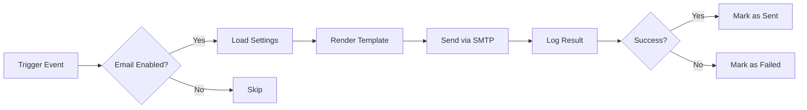

# Email System Documentation

**Last Updated**: 2025-11-13

Comprehensive documentation for the Tulumbak email management system featuring React Email templates, SMTP configuration, and delivery tracking.

## Overview

The email system provides a modern, flexible solution for sending transactional emails with comprehensive logging and management capabilities.

### Key Features

- **React Email Templates**: Modern email templates using React components
- **SWC Transpilation**: Fast TypeScript/JSX compilation for email templates
- **SMTP Configuration**: Flexible SMTP server setup with SSL/TLS support
- **Email Logging**: Track all sent emails with full content and metadata
- **Trigger Management**: Enable/disable email types individually
- **Logo Management**: URL-based or file upload with Cloudinary
- **Template Testing**: Test emails before sending to customers
- **Branding Customization**: Custom colors, logos, and styling

---

## Architecture

### Components

```
Email System
├── EmailService.js         # Core email sending service
├── EmailRenderer.js        # React Email template renderer
├── EmailSettingsModel.js   # Configuration schema
├── EmailLogModel.js        # Logging schema
├── EmailTemplateModel.js   # Custom templates schema
├── emails/                 # React Email templates
│   ├── OrderConfirmation.jsx
│   ├── OrderStatusUpdate.jsx
│   ├── DeliveryNotification.jsx
│   └── components/         # Reusable components
└── emailRoute.js          # API endpoints
```

### Email Flow



---

## Configuration

### SMTP Settings

**Environment Variables:**
```env
SMTP_HOST=smtp.gmail.com
SMTP_PORT=587
SMTP_USER=your_email@gmail.com
SMTP_PASSWORD=your_app_password
```

**Supported SMTP Providers:**
- Gmail (smtp.gmail.com)
- Outlook/Office365 (smtp.office365.com)
- SendGrid (smtp.sendgrid.net)
- Mailgun (smtp.mailgun.org)
- Custom SMTP servers

**Port Configuration:**
- **587**: TLS/STARTTLS (recommended)
- **465**: SSL (legacy, still supported)
- **25**: Plain SMTP (not recommended)

### Email Settings Schema

```javascript
{
  smtp: {
    enabled: Boolean,
    host: String,
    port: Number (587, 465, 25),
    secure: Boolean,
    user: String,
    password: String (encrypted),
    fromName: String,
    fromEmail: String
  },
  triggers: {
    userRegistration: Boolean,
    orderCreated: Boolean,
    orderStatusUpdate: Boolean,
    orderPreparing: Boolean,
    courierAssigned: Boolean,
    orderDelivered: Boolean,
    paymentReceived: Boolean,
    paymentFailed: Boolean,
    lowStock: Boolean,
    newReview: Boolean
  },
  logging: {
    enabled: Boolean,
    retentionDays: Number,
    logSuccessful: Boolean,
    logFailed: Boolean
  },
  general: {
    enabled: Boolean, // Master on/off switch
    bccAdmin: Boolean,
    adminEmail: String
  },
  design: {
    logoUrl: String,
    brandColor: String,
    storeName: String,
    storeEmail: String,
    storePhone: String,
    fontFamily: String,
    privacyPolicyUrl: String,
    emailPreferencesUrl: String,
    unsubscribeUrl: String
  }
}
```

---

## Email Triggers

### Available Triggers

| Trigger | Event | Recipient | Enabled by Default |
|---------|-------|-----------|-------------------|
| `userRegistration` | New user signs up | User | Yes |
| `orderCreated` | Order placed | User | Yes |
| `orderStatusUpdate` | Order status changes | User | Yes |
| `orderPreparing` | Order being prepared | User | Yes |
| `courierAssigned` | Courier assigned | User | Yes |
| `orderDelivered` | Order delivered | User | Yes |
| `paymentReceived` | Payment confirmed | User | Yes |
| `paymentFailed` | Payment failed | User | No |
| `lowStock` | Product low stock | Admin | Yes |
| `newReview` | Customer review posted | Admin | No |

### Trigger Configuration

**Enable/Disable Triggers:**
```javascript
// Via API
PUT /api/email/settings
{
  "triggers": {
    "orderCreated": true,
    "orderStatusUpdate": true,
    "paymentFailed": false
  }
}

// Programmatically
const settings = await EmailSettings.findOne();
settings.triggers.orderCreated = false;
await settings.save();
```

---

## React Email Templates

### Template Structure

Templates are React components located in `/backend/emails/`:

```jsx
// emails/OrderConfirmation.jsx
import { Html, Head, Body, Container, Text, Button } from '@react-email/components';
import EmailHeader from './components/EmailHeader';
import EmailFooter from './components/EmailFooter';

export default function OrderConfirmation({ orderId, customerName, items, total }) {
  return (
    <Html lang="tr">
      <Head>
        <title>Sipariş Onayı</title>
      </Head>
      <Body style={bodyStyle}>
        <Container style={containerStyle}>
          <EmailHeader />

          <Text style={headingStyle}>
            Siparişiniz Alındı!
          </Text>

          <Text style={textStyle}>
            Merhaba {customerName},
          </Text>

          <Text style={textStyle}>
            {orderId} numaralı siparişiniz başarıyla alındı.
          </Text>

          {/* Order Items */}
          {items.map(item => (
            <div key={item.id} style={itemStyle}>
              <Text>{item.name} - {item.size}</Text>
              <Text>{item.quantity} adet - ₺{item.price}</Text>
            </div>
          ))}

          <Text style={totalStyle}>
            Toplam: ₺{total}
          </Text>

          <Button href={`https://tulumbak.com/orders/${orderId}`} style={buttonStyle}>
            Siparişimi Takip Et
          </Button>

          <EmailFooter />
        </Container>
      </Body>
    </Html>
  );
}

const bodyStyle = {
  backgroundColor: '#f6f6f6',
  fontFamily: '-apple-system, BlinkMacSystemFont, "Segoe UI", Roboto, sans-serif'
};

const containerStyle = {
  backgroundColor: '#ffffff',
  margin: '0 auto',
  padding: '40px 20px',
  maxWidth: '600px'
};

const headingStyle = {
  fontSize: '24px',
  fontWeight: 'bold',
  color: '#333',
  marginBottom: '20px'
};

const textStyle = {
  fontSize: '16px',
  color: '#555',
  lineHeight: '1.6',
  marginBottom: '10px'
};

const itemStyle = {
  border: '1px solid #eee',
  borderRadius: '8px',
  padding: '15px',
  marginBottom: '10px',
  backgroundColor: '#f9f9f9'
};

const totalStyle = {
  fontSize: '20px',
  fontWeight: 'bold',
  color: '#d4af37',
  marginTop: '20px'
};

const buttonStyle = {
  backgroundColor: '#d4af37',
  color: '#ffffff',
  padding: '12px 30px',
  borderRadius: '5px',
  textDecoration: 'none',
  display: 'inline-block',
  marginTop: '20px'
};
```

### Reusable Components

**Email Header:**
```jsx
// emails/components/EmailHeader.jsx
export default function EmailHeader({ logoUrl, storeName }) {
  return (
    <div style={headerStyle}>
      
      <h1 style={titleStyle}>{storeName}</h1>
    </div>
  );
}
```

**Email Footer:**
```jsx
// emails/components/EmailFooter.jsx
export default function EmailFooter({ storeEmail, storePhone, privacyUrl, unsubscribeUrl }) {
  return (
    <div style={footerStyle}>
      <p>
        {storeEmail} | {storePhone}
      </p>
      <p>
        <a href={privacyUrl}>Gizlilik Politikası</a> |
        <a href={unsubscribeUrl}>Abonelikten Çık</a>
      </p>
      <p style={copyrightStyle}>
        © 2024 Tulumbak İzmir Baklava. Tüm hakları saklıdır.
      </p>
    </div>
  );
}
```

### Modern Card-Based Design

The email templates use a modern card-based layout:

```jsx
// Order Items Card
<div style={{
  backgroundColor: '#fff',
  border: '1px solid #e0e0e0',
  borderRadius: '12px',
  padding: '20px',
  marginBottom: '16px',
  boxShadow: '0 2px 4px rgba(0,0,0,0.05)'
}}>
  <div style={{
    display: 'flex',
    justifyContent: 'space-between',
    marginBottom: '12px'
  }}>
    <span style={{ fontWeight: '600' }}>Fıstıklı Baklava</span>
    <span style={{ color: '#d4af37' }}>₺125.00</span>
  </div>
  <div style={{ color: '#666', fontSize: '14px' }}>
    500g • 2 adet
  </div>
</div>
```

---

## Template Rendering

### SWC Transpilation

Email templates are transpiled using SWC for fast compilation:

**SWC Configuration (`.swcrc`):**
```json
{
  "jsc": {
    "parser": {
      "syntax": "ecmascript",
      "jsx": true
    },
    "transform": {
      "react": {
        "runtime": "automatic"
      }
    },
    "target": "es2020"
  },
  "module": {
    "type": "es6"
  }
}
```

### EmailRenderer Service

**Rendering Process:**
```javascript
import { render } from '@react-email/render';
import OrderConfirmation from '../emails/OrderConfirmation.jsx';

class EmailRenderer {
  async renderOrderConfirmation(data) {
    try {
      const html = await render(
        <OrderConfirmation
          orderId={data.orderId}
          customerName={data.customerName}
          items={data.items}
          total={data.total}
        />
      );

      return { success: true, html };
    } catch (error) {
      logger.error('Email render error', { error: error.message });
      return { success: false, error: error.message };
    }
  }
}
```

---

## Sending Emails

### Using EmailService

**Send Order Confirmation:**
```javascript
import emailService from '../services/EmailService.js';

// Prepare order data
const orderData = {
  orderId: 'ORD-1699707600000',
  customerName: 'Ahmet Yılmaz',
  customerEmail: 'ahmet@example.com',
  items: [
    {
      name: 'Fıstıklı Baklava',
      size: '500g',
      quantity: 2,
      price: 125.00
    }
  ],
  subtotal: 250.00,
  shipping: 25.00,
  total: 275.00,
  deliveryDate: '2024-11-15',
  shippingAddress: 'Atatürk Cad. No:123, Konak, İzmir'
};

// Send email
const result = await emailService.sendReactEmail(
  'order-confirmation',
  orderData,
  orderData.customerEmail
);

if (result.success) {
  console.log('Email sent successfully');
} else {
  console.error('Email failed:', result.message);
}
```

### Template Types

| Template Type | File | Use Case |
|--------------|------|----------|
| `order-confirmation` | OrderConfirmation.jsx | New order placed |
| `order-status-update` | OrderStatusUpdate.jsx | Order status changed |
| `delivery-notification` | DeliveryNotification.jsx | Delivery updates |
| `welcome-email` | WelcomeEmail.jsx | New user registration |
| `password-reset` | PasswordReset.jsx | Password reset request |

---

## Email Logging

### Automatic Logging

All sent emails are automatically logged:

```javascript
{
  trigger: 'order-confirmation',
  to: 'customer@example.com',
  from: '"Tulumbak Baklava" <noreply@tulumbak.com>',
  subject: 'Sipariş Onayı - ORD-1699707600000',
  htmlContent: '<html>...</html>', // Full HTML
  status: 'sent',
  sentAt: '2024-11-13T10:00:00.000Z',
  messageId: '<unique@message.id>',
  metadata: {
    orderId: 'ORD-1699707600000',
    userId: '507f1f77bcf86cd799439011',
    templateType: 'order-confirmation'
  }
}
```

### Viewing Logs

**API Endpoint:**
```http
GET /api/email/logs?page=1&limit=50&trigger=order-confirmation&status=sent
```

**Response:**
```json
{
  "success": true,
  "logs": [
    {
      "_id": "507f1f77bcf86cd799439011",
      "trigger": "order-confirmation",
      "to": "customer@example.com",
      "subject": "Sipariş Onayı",
      "status": "sent",
      "sentAt": "2024-11-13T10:00:00.000Z"
    }
  ],
  "pagination": {
    "page": 1,
    "limit": 50,
    "total": 256,
    "pages": 6
  }
}
```

### Log Statistics

**Get Email Stats:**
```http
GET /api/email/logs/stats/overview?startDate=2024-11-01&endDate=2024-11-13
```

**Response:**
```json
{
  "success": true,
  "stats": {
    "total": 1250,
    "byStatus": [
      { "_id": "sent", "count": 1180 },
      { "_id": "failed", "count": 70 }
    ],
    "byTrigger": [
      { "_id": "order-confirmation", "count": 650 },
      { "_id": "order-status-update", "count": 400 },
      { "_id": "delivery-notification", "count": 200 }
    ]
  }
}
```

---

## Testing Emails

### SMTP Connection Test

**Test SMTP Configuration:**
```http
POST /api/email/settings/test
Content-Type: application/json

{
  "host": "smtp.gmail.com",
  "port": 587,
  "user": "your@gmail.com",
  "password": "your_app_password",
  "testEmail": "test@example.com"
}
```

**Response (Success):**
```json
{
  "success": true,
  "message": "Test email sent successfully"
}
```

**Response (Error):**
```json
{
  "success": false,
  "message": "Invalid login: 535-5.7.8 Username and Password not accepted",
  "code": "EAUTH",
  "guidance": "Check your email and password. For Gmail, use App Password."
}
```

### Template Test

**Test React Email Template:**
```http
POST /api/email/settings/test-template
Content-Type: application/json

{
  "templateType": "order-confirmation",
  "testEmail": "test@example.com"
}
```

This sends a test email with sample data to verify template rendering.

---

## Logo Management

### Logo Upload Options

**1. URL-Based Logo:**
```javascript
{
  "design": {
    "logoType": "url",
    "logoUrl": "https://tulumbak.com/logo.png"
  }
}
```

**2. File Upload (Cloudinary):**
```http
POST /api/email/settings/upload-logo
Content-Type: multipart/form-data

file: [logo.png]
```

**Response:**
```json
{
  "success": true,
  "logoUrl": "https://res.cloudinary.com/tulumbak/image/upload/v1699707600/email-logos/logo.png",
  "design": {
    "logoType": "upload",
    "logoUrl": "https://res.cloudinary.com/..."
  }
}
```

### Logo Preview

The logo is displayed in email headers with responsive sizing:

```jsx

```

---

## Troubleshooting

### Common Issues

**1. Authentication Failed (Gmail)**

**Error:** `Invalid login: 535-5.7.8 Username and Password not accepted`

**Solution:**
- Enable 2-Step Verification on Google Account
- Generate App Password: Account → Security → 2-Step Verification → App passwords
- Use App Password instead of account password

**2. Connection Timeout**

**Error:** `ETIMEDOUT` or `ECONNREFUSED`

**Solution:**
- Check SMTP host and port
- Verify firewall/network restrictions
- Try alternative port (587 → 465)
- Check SMTP server status

**3. Port 465 SSL Issues**

**Error:** `Error: self signed certificate`

**Solution:**
- Use port 587 with TLS instead
- Or configure SSL properly:
```javascript
{
  port: 465,
  secure: true, // Use SSL
  tls: {
    rejectUnauthorized: false // Development only
  }
}
```

**4. Email Not Received**

**Checklist:**
- Check spam/junk folder
- Verify recipient email address
- Check email logs for send status
- Verify SMTP credentials
- Check daily sending limits

**5. Template Rendering Errors**

**Error:** `Cannot render template`

**Solution:**
- Verify all required props are provided
- Check template syntax errors
- Ensure React Email packages are installed
- Review EmailRenderer logs

---

## Best Practices

### Email Design

1. **Mobile-First**: Design for mobile screens first
2. **Simple Layouts**: Use single-column layouts
3. **Inline Styles**: Always use inline CSS
4. **Alt Text**: Provide alt text for images
5. **Call-to-Action**: Clear, prominent CTAs
6. **Brand Consistency**: Use brand colors and fonts

### Performance

1. **Image Optimization**: Compress images, use CDN
2. **Minimal External Resources**: Limit external dependencies
3. **Template Caching**: Cache rendered templates
4. **Batch Sending**: Send bulk emails in batches

### Deliverability

1. **SPF Records**: Configure SPF for your domain
2. **DKIM Signing**: Enable DKIM authentication
3. **Unsubscribe Link**: Always include unsubscribe option
4. **Plain Text Version**: Provide plain text alternative
5. **List Hygiene**: Remove bounced/inactive emails

### Security

1. **Encrypt Passwords**: Store SMTP passwords encrypted
2. **Rate Limiting**: Limit email sending per user/IP
3. **Validate Recipients**: Verify email addresses before sending
4. **Secure Credentials**: Never expose SMTP credentials in code
5. **HTTPS Only**: Use secure connections for admin panel

---

## Admin Panel Integration

### Email Settings Page

**Location:** `/admin/src/pages/email/`

**Features:**
- SMTP configuration form
- Trigger toggle switches
- Logo upload with preview
- Test email functionality
- Email logs viewer
- Statistics dashboard

**API Endpoints Used:**
- `GET /api/email/settings`: Load settings
- `PUT /api/email/settings`: Update settings
- `POST /api/email/settings/test`: Test SMTP
- `POST /api/email/settings/test-template`: Test template
- `GET /api/email/logs`: View logs
- `GET /api/email/logs/stats/overview`: View statistics

---

## Migration Guide

### From Legacy System

**1. Backup existing templates**
**2. Install dependencies:**
```bash
npm install @react-email/components @react-email/render react react-dom @swc-node/register @swc/core
```

**3. Configure SWC:**
Create `.swcrc` file with configuration

**4. Create React Email templates**
Convert existing HTML templates to React components

**5. Update EmailService:**
Replace template rendering with React Email

**6. Test thoroughly:**
- Test SMTP connection
- Test all template types
- Verify email logs
- Check deliverability

---

**For API documentation, see**: [API Reference](./API-Reference.md)
**For service layer documentation, see**: [Services Documentation](./Services.md)
**For admin panel documentation, see**: [Admin Panel Setup](../Admin-Panel/Setup.md)
