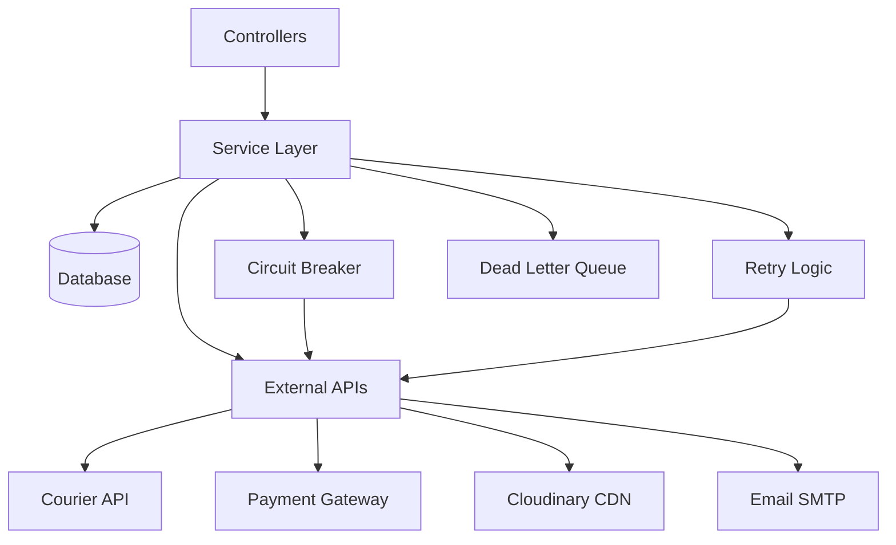

# Backend Services Documentation

**Last Updated**: 2025-11-13

Core service layer documentation for Tulumbak E-Commerce Platform.

## Overview

The service layer implements business logic and external integrations, providing a clean separation between controllers and data models. Services handle:

- Email delivery and management
- Courier integration
- Circuit breaker pattern for fault tolerance
- Retry logic for transient failures
- Rate limiting
- Media management

---

## EmailService

Handles all email operations including SMTP configuration, template rendering, and delivery tracking.

### Features

- **SMTP Configuration**: Dynamic configuration with SSL/TLS support
- **React Email Templates**: Modern email templates with SWC transpilation
- **Email Logging**: Comprehensive logging with trigger tracking
- **Connection Verification**: SMTP connection testing before sending
- **Retry Logic**: Automatic retry for transient failures

### Configuration

**Environment Variables:**
```env
SMTP_HOST=smtp.gmail.com
SMTP_PORT=587
SMTP_USER=your_email@gmail.com
SMTP_PASSWORD=your_app_password
```

**Port Configuration:**
- `587`: TLS/STARTTLS (recommended)
- `465`: SSL (legacy but supported)
- `25`: Plain SMTP (not recommended)

### Methods

#### `init()`

Initialize SMTP transporter with environment configuration.

```javascript
init() {
  const smtpPort = parseInt(process.env.SMTP_PORT) || 587;

  this.transporter = nodemailer.createTransport({
    host: process.env.SMTP_HOST,
    port: smtpPort,
    secure: smtpPort === 465, // SSL for port 465
    auth: {
      user: process.env.SMTP_USER,
      pass: process.env.SMTP_PASSWORD,
    },
    connectionTimeout: 60000,
    greetingTimeout: 30000,
    socketTimeout: 60000,
  });
}
```

#### `updateConfiguration(smtpConfig)`

Dynamically update SMTP configuration from admin panel.

**Parameters:**
- `smtpConfig`: Object with SMTP settings

```javascript
updateConfiguration({
  host: 'smtp.gmail.com',
  port: 587,
  user: 'your@gmail.com',
  password: 'app_password',
  enabled: true
});
```

#### `verifyConnection()`

Verify SMTP connection before sending emails.

**Returns:** `Promise<{ success: boolean, message: string, code?: string }>`

```javascript
const result = await emailService.verifyConnection();
if (result.success) {
  console.log('SMTP connection verified');
} else {
  console.error('SMTP error:', result.message);
}
```

**Error Codes:**
- `EAUTH`: Authentication failed (wrong credentials)
- `ENOTFOUND`: Server not found (wrong host)
- `ETIMEDOUT`: Connection timeout
- `ECONNREFUSED`: Connection refused (port/firewall issue)

#### `sendEmail(options)`

Send generic email with custom HTML content.

**Parameters:**
```javascript
{
  from: 'Tulumbak Baklava <noreply@tulumbak.com>',
  to: 'customer@example.com',
  subject: 'Order Confirmation',
  html: '<h1>Thank you for your order</h1>',
  attachments: [] // optional
}
```

**Returns:** `Promise<{ success: boolean, messageId?: string }>`

#### `sendReactEmail(templateType, data, to)`

Send email using React Email templates.

**Template Types:**
- `order-confirmation`: New order confirmation
- `order-status-update`: Order status change notification
- `delivery-notification`: Delivery information
- `password-reset`: Password reset link
- `welcome-email`: New user welcome

**Example:**
```javascript
const result = await emailService.sendReactEmail(
  'order-confirmation',
  {
    customerName: 'Ahmet Yılmaz',
    orderId: 'ORD-1699707600000',
    items: [...],
    total: 350.00
  },
  'customer@example.com'
);
```

#### `getAvailableTemplates()`

Get list of available React Email templates.

**Returns:** `Array<{ name: string, description: string }>`

### Email Logging

All sent emails are automatically logged to the database:

```javascript
{
  trigger: 'order-confirmation',
  to: 'customer@example.com',
  from: 'noreply@tulumbak.com',
  subject: 'Order Confirmation',
  htmlContent: '<html>...</html>',
  status: 'sent',
  sentAt: '2024-11-13T10:00:00.000Z',
  messageId: '<unique@message.id>'
}
```

### React Email Templates

Templates located in `/backend/emails/`:

```
emails/
├── components/           # Reusable email components
│   ├── EmailHeader.jsx
│   ├── EmailFooter.jsx
│   ├── OrderSummary.jsx
│   └── Button.jsx
├── OrderConfirmation.jsx
├── OrderStatusUpdate.jsx
├── DeliveryNotification.jsx
└── WelcomeEmail.jsx
```

**Template Structure:**
```jsx
import { Html, Head, Body, Container } from '@react-email/components';

export default function OrderConfirmation({ orderId, items, total }) {
  return (
    <Html>
      <Head />
      <Body>
        <Container>
          <h1>Order Confirmation</h1>
          <p>Order ID: {orderId}</p>
          <p>Total: ₺{total}</p>
        </Container>
      </Body>
    </Html>
  );
}
```

### Troubleshooting

**Gmail Authentication Issues:**

1. Enable "Less secure app access" OR
2. Use App Password:
   - Go to Google Account → Security → 2-Step Verification → App passwords
   - Generate password for "Mail" app
   - Use generated password in `SMTP_PASSWORD`

**Port 465 SSL Configuration:**

```env
SMTP_PORT=465
# Service automatically enables SSL for port 465
```

**Connection Timeouts:**

- Increase timeout values in `init()` method
- Check firewall/network restrictions
- Verify SMTP server availability

---

## MuditaKuryeService

Courier integration service for MuditaKurye delivery platform.

### Features

- **API Authentication**: Token-based authentication
- **Order Submission**: Submit orders to courier
- **Status Tracking**: Real-time delivery status updates
- **Webhook Integration**: Receive status updates from courier
- **Circuit Breaker**: Fault-tolerant API calls
- **Retry Logic**: Automatic retry for failed operations

### Configuration

**Environment Variables:**
```env
MUDITA_ENABLED=true
MUDITA_TEST_MODE=false
MUDITA_API_URL=https://api.muditakurye.com.tr
MUDITA_API_KEY=yk_YOUR_API_KEY
MUDITA_API_SECRET=your_api_secret
MUDITA_WEBHOOK_SECRET=wh_YOUR_WEBHOOK_SECRET
MUDITA_RESTAURANT_ID=rest_YOUR_RESTAURANT_ID
MUDITA_WEBHOOK_ONLY_MODE=false
```

### Operating Modes

**1. Full Integration Mode** (`MUDITA_WEBHOOK_ONLY_MODE=false`)
- Submit orders via API
- Receive webhook updates
- Track delivery status

**2. Webhook-Only Mode** (`MUDITA_WEBHOOK_ONLY_MODE=true`)
- Orders created manually in MuditaKurye panel
- Only receive webhook updates
- No API order submission

### Methods

#### `initialize()`

Initialize service with database configuration or environment variables.

```javascript
await MuditaKuryeService.initialize();
```

#### `authenticate()`

Obtain authentication token from MuditaKurye API.

**Returns:** `Promise<{ success: boolean, token: string }>`

```javascript
const auth = await service.authenticate();
if (auth.success) {
  console.log('Authenticated with token:', auth.token);
}
```

#### `submitOrder(orderData)`

Submit order to courier service.

**Parameters:**
```javascript
{
  orderId: 'ORD-1699707600000',
  customerName: 'Ahmet Yılmaz',
  customerPhone: '+905551234567',
  deliveryAddress: {
    street: 'Atatürk Cad. No:123',
    district: 'Konak',
    city: 'İzmir',
    zipCode: '35000',
    coordinates: { lat: 38.4192, lng: 27.1287 }
  },
  items: [...],
  amount: 350.00,
  paymentMethod: 'credit_card',
  notes: 'Please call before delivery'
}
```

**Returns:**
```javascript
{
  success: true,
  trackingNumber: 'TRK-1699707600000',
  estimatedDelivery: '2024-11-15T14:00:00.000Z',
  courierId: 'COU-12345'
}
```

#### `getDeliveryStatus(trackingNumber)`

Get current delivery status.

**Returns:**
```javascript
{
  trackingNumber: 'TRK-1699707600000',
  status: 'in_transit',
  currentLocation: 'Konak Distribution Center',
  estimatedDelivery: '2024-11-15T14:00:00.000Z',
  courierName: 'Mehmet Courier',
  courierPhone: '+905559876543',
  history: [
    {
      status: 'picked_up',
      location: 'Tulumbak Baklava',
      timestamp: '2024-11-13T10:00:00.000Z'
    }
  ]
}
```

#### `cancelDelivery(trackingNumber, reason)`

Cancel a delivery.

**Returns:** `Promise<{ success: boolean }>`

### Webhook Handling

MuditaKurye sends webhook updates for delivery status changes.

**Webhook Endpoint:** `POST /api/webhook/muditakurye`

**Webhook Payload:**
```json
{
  "event": "delivery.status.update",
  "trackingNumber": "TRK-1699707600000",
  "orderId": "ORD-1699707600000",
  "status": "delivered",
  "timestamp": "2024-11-15T14:30:00.000Z",
  "location": {
    "lat": 38.4192,
    "lng": 27.1287,
    "address": "Customer Location"
  },
  "signature": "webhook_signature_hash"
}
```

**Webhook Verification:**
```javascript
const isValid = WebhookSecurity.verifySignature(
  payload,
  signature,
  webhookSecret
);
```

### Status Mapping

| MuditaKurye Status | Internal Status | Description |
|-------------------|----------------|-------------|
| `assigned` | `assigned` | Courier assigned |
| `picked_up` | `in_transit` | Order picked up |
| `in_transit` | `in_transit` | On the way |
| `delivered` | `delivered` | Successfully delivered |
| `failed` | `failed` | Delivery failed |
| `cancelled` | `cancelled` | Delivery cancelled |

### Error Handling

Service uses Circuit Breaker pattern to handle API failures:

```javascript
try {
  const result = await service.submitOrder(orderData);
} catch (error) {
  if (error.code === 'CIRCUIT_OPEN') {
    // Circuit breaker open, too many failures
    // Queue order for later retry
  } else {
    // Handle other errors
  }
}
```

---

## CircuitBreakerService

Implements circuit breaker pattern to prevent cascading failures.

### Features

- **Failure Tracking**: Count consecutive failures
- **Circuit States**: Closed → Open → Half-Open
- **Auto-Recovery**: Automatic retry after timeout
- **Monitoring**: Circuit state logging

### Configuration

```env
CIRCUIT_BREAKER_ENABLED=true
CIRCUIT_BREAKER_FAILURE_THRESHOLD=5
CIRCUIT_BREAKER_TIMEOUT=60000
CIRCUIT_BREAKER_RESET_TIMEOUT=120000
```

### States

**1. Closed (Normal)**
- All requests pass through
- Failure count tracked

**2. Open (Failure)**
- All requests immediately fail
- No external calls made
- Entered after reaching failure threshold

**3. Half-Open (Testing)**
- Single test request allowed
- Success → Close circuit
- Failure → Reopen circuit

### Methods

#### `execute(key, operation, fallback)`

Execute operation with circuit breaker protection.

**Example:**
```javascript
const result = await CircuitBreakerService.execute(
  'muditakurye-api',
  async () => {
    return await muditaService.submitOrder(data);
  },
  async () => {
    // Fallback: Queue order for later
    return { success: false, queued: true };
  }
);
```

#### `getState(key)`

Get current circuit state.

**Returns:** `'CLOSED' | 'OPEN' | 'HALF_OPEN'`

#### `reset(key)`

Manually reset circuit to closed state.

---

## RetryService

Implements exponential backoff retry logic for transient failures.

### Configuration

```env
RETRY_MAX_ATTEMPTS=5
RETRY_BASE_DELAY=1000
RETRY_MAX_DELAY=300000
```

### Features

- **Exponential Backoff**: Delay increases with each retry
- **Jitter**: Random variation to prevent thundering herd
- **Max Delay Cap**: Prevent excessive delays
- **Retry Conditions**: Configurable retry logic

### Methods

#### `executeWithRetry(operation, options)`

Execute operation with automatic retry.

**Options:**
```javascript
{
  maxAttempts: 5,
  baseDelay: 1000,
  maxDelay: 300000,
  shouldRetry: (error) => error.code !== 'INVALID_DATA'
}
```

**Example:**
```javascript
const result = await RetryService.executeWithRetry(
  async () => {
    return await externalApi.call();
  },
  {
    maxAttempts: 3,
    shouldRetry: (error) => {
      // Retry on network errors, not validation errors
      return error.code === 'ECONNREFUSED' || error.code === 'ETIMEDOUT';
    }
  }
);
```

### Retry Logic

```
Attempt 1: Immediate
Attempt 2: Wait 1s + jitter
Attempt 3: Wait 2s + jitter
Attempt 4: Wait 4s + jitter
Attempt 5: Wait 8s + jitter
```

Jitter: Random value between 0-1000ms

---

## RateLimiterService

Implements rate limiting for API endpoints.

### Features

- **Per-Endpoint Limits**: Different limits per route
- **Sliding Window**: Time-based rate limiting
- **IP-Based Tracking**: Track requests per IP
- **Custom Responses**: Configurable error messages

### Methods

#### `createGeneralLimiter(max, windowMs)`

Create general API rate limiter.

**Example:**
```javascript
// 100 requests per 15 minutes
app.use('/api', RateLimiterService.createGeneralLimiter(100, 15 * 60 * 1000));
```

#### `createOrderLimiter()`

Create order-specific rate limiter.

**Default:** 5 requests per 15 minutes

```javascript
orderRouter.post('/place', authUser, RateLimiterService.createOrderLimiter(), placeOrder);
```

#### `createUploadLimiter()`

Create file upload rate limiter.

**Default:** 10 requests per 15 minutes

```javascript
productRouter.post('/add', adminAuth, RateLimiterService.createUploadLimiter(), addProduct);
```

### Rate Limit Headers

```http
X-RateLimit-Limit: 100
X-RateLimit-Remaining: 95
X-RateLimit-Reset: 1699708500000
```

---

## MediaService

Handles media file management and Cloudinary integration.

### Features

- **File Upload**: Upload to Cloudinary
- **Image Optimization**: Automatic format conversion and compression
- **URL Generation**: Secure URL generation with transformations
- **Thumbnail Generation**: Auto-generate thumbnails
- **Metadata Extraction**: Extract image metadata

### Methods

#### `uploadImage(file, options)`

Upload image to Cloudinary.

**Options:**
```javascript
{
  folder: 'products',
  transformation: {
    width: 1200,
    height: 1200,
    crop: 'limit',
    quality: 'auto',
    format: 'auto'
  }
}
```

**Returns:**
```javascript
{
  success: true,
  url: 'https://res.cloudinary.com/tulumbak/image/upload/v1699707600/products/baklava.jpg',
  publicId: 'products/baklava',
  format: 'jpg',
  width: 1200,
  height: 1200,
  size: 245678
}
```

#### `deleteImage(publicId)`

Delete image from Cloudinary.

#### `getOptimizedUrl(publicId, transformations)`

Generate optimized image URL with transformations.

**Example:**
```javascript
const url = MediaService.getOptimizedUrl('products/baklava', {
  width: 300,
  height: 300,
  crop: 'fill',
  gravity: 'auto',
  quality: 'auto',
  format: 'webp'
});
// https://res.cloudinary.com/tulumbak/image/upload/w_300,h_300,c_fill,g_auto,q_auto,f_webp/products/baklava
```

---

## OutgoingWebhookService

Manages outgoing webhooks to external systems.

### Features

- **Webhook Configuration**: Configure webhook endpoints
- **Signature Signing**: HMAC signature for security
- **Retry Logic**: Automatic retry for failed webhooks
- **Dead Letter Queue**: Failed webhooks stored for manual retry
- **Event Filtering**: Subscribe to specific events

### Events

- `order.created`
- `order.status.updated`
- `order.delivered`
- `product.created`
- `product.updated`
- `delivery.status.updated`

### Methods

#### `sendWebhook(event, payload)`

Send webhook to subscribed endpoints.

**Example:**
```javascript
await OutgoingWebhookService.sendWebhook('order.created', {
  orderId: 'ORD-1699707600000',
  amount: 350.00,
  items: [...]
});
```

#### `retryFailedWebhook(webhookId)`

Manually retry failed webhook.

---

## Best Practices

### Service Layer

1. **Keep services stateless** where possible
2. **Use dependency injection** for testing
3. **Log all external API calls** with correlation IDs
4. **Implement proper error handling** with specific error types
5. **Use circuit breakers** for external services
6. **Cache expensive operations** with proper TTL

### Email Service

1. **Always verify connection** before sending
2. **Log all email attempts** including failures
3. **Use environment-specific templates**
4. **Implement rate limiting** for email sending
5. **Handle transient failures** with retry logic

### Courier Integration

1. **Use webhook-only mode** when possible to reduce API calls
2. **Verify webhook signatures** for security
3. **Store tracking numbers** for all deliveries
4. **Implement fallback** for API failures
5. **Log all courier interactions** with correlation IDs

---

## Service Architecture Diagram



---

**For API endpoint documentation, see**: [API Reference](./API-Reference.md)
**For database schema details, see**: [Database Schema](./Database-Schema.md)
**For integration guides, see**: [Integrations Documentation](../Integrations/)
